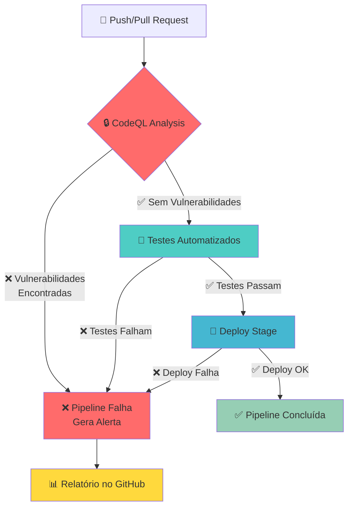
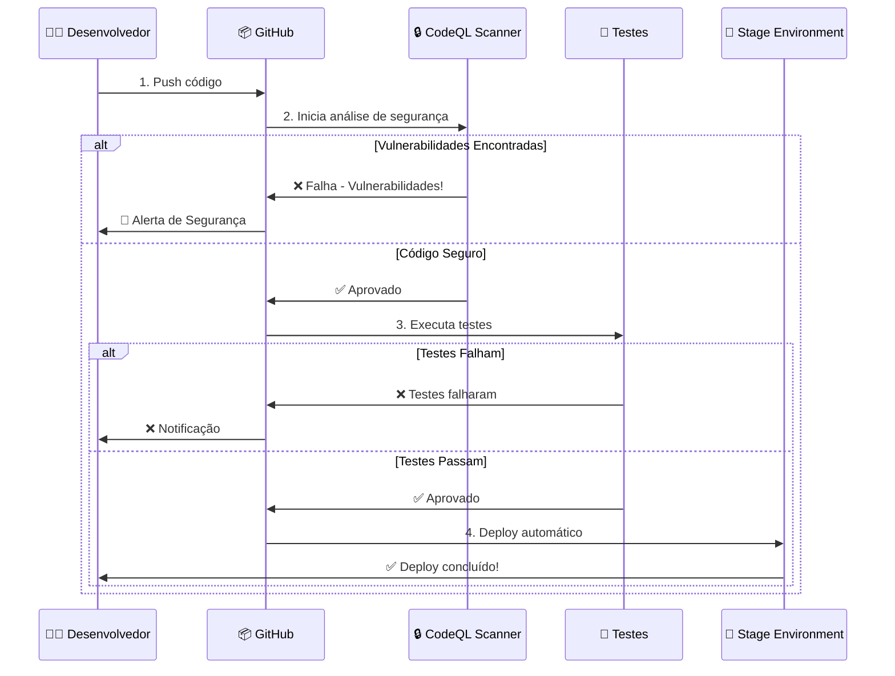

# 🔐 Pipeline CI/CD com CodeQL - FATEC

## 📚 Projeto Educacional - Desenvolvimento de Sistemas

Este repositório demonstra como configurar uma **pipeline CI/CD completa** com análise de segurança usando **GitHub CodeQL** para projetos Python.

---

## 🎯 Objetivos de Aprendizagem

Ao final deste projeto, você será capaz de:

- ✅ Configurar GitHub Actions para CI/CD
- ✅ Implementar análise de segurança com CodeQL
- ✅ Entender o fluxo de integração e entrega contínua
- ✅ Configurar ambientes de deploy (Stage/Production)
- ✅ Interpretar relatórios de vulnerabilidades

---

## 🏗️ Arquitetura da Pipeline



---

## 🔄 Fluxo Detalhado da Pipeline



---

## 📋 Estrutura do Projeto

```
hello/
├── .github/
│   ├── workflows/
│   │   └── ci-cd-pipeline.yml    # 🔧 Pipeline principal
│   └── codeql-config.yml         # ⚙️ Configuração CodeQL
├── main.py                        # 🐍 Código Python
├── requirements.txt               # 📦 Dependências
└── README.md                      # 📚 Documentação
```

---

## 🚀 Guia Passo a Passo

### **Passo 1: Configuração Inicial no GitHub**

1. **Habilitar GitHub Advanced Security** (se ainda não estiver habilitado):
   - Vá em `Settings` → `Code security and analysis`
   - Ative `CodeQL analysis`

2. **Criar os arquivos necessários** (já incluídos neste projeto):
   - `.github/workflows/ci-cd-pipeline.yml`
   - `.github/codeql-config.yml`

### **Passo 2: Entendendo a Pipeline**

A pipeline possui **3 jobs sequenciais**:

#### **Job 1: 🔒 Análise CodeQL (Segurança)**

```yaml
codeql-analysis:
  - Checkout do código
  - Configura Python 3.11
  - Instala dependências
  - Inicializa CodeQL para Python
  - Executa análise de segurança
  - ⚠️ FALHA se encontrar vulnerabilidades
```

**O que o CodeQL detecta?**
- Injeção de SQL
- Cross-Site Scripting (XSS)
- Deserialização insegura
- Uso de funções inseguras
- Vazamento de dados sensíveis
- E muito mais...

#### **Job 2: 🧪 Testes Automatizados**

```yaml
tests:
  needs: codeql-analysis  # ⚠️ Só executa se CodeQL passar
  - Checkout do código
  - Instala dependências + pytest
  - Executa testes unitários
  - Valida qualidade do código (flake8)
```

#### **Job 3: 🚀 Deploy para Stage**

```yaml
deploy-stage:
  needs: [codeql-analysis, tests]  # ⚠️ Só executa se ambos passarem
  - Prepara artefatos
  - Realiza deploy em Stage
  - Notifica conclusão
```

### **Passo 3: Configuração de Ambientes**

1. No GitHub, vá em `Settings` → `Environments`
2. Crie um ambiente chamado `stage`
3. (Opcional) Configure regras de proteção:
   - Revisores obrigatórios
   - Tempo de espera
   - Branch específica

### **Passo 4: Executando a Pipeline**

A pipeline executa automaticamente quando:

- ✅ Há um **push** na branch `main`
- ✅ Há um **pull request** para `main`
- ✅ Você executa **manualmente** em `Actions` → `CI/CD Pipeline` → `Run workflow`

---

## 🔍 Como Visualizar Resultados

### **1. Status da Pipeline**

Acesse: `Actions` → Selecione a execução mais recente

Você verá:
```
🔒 Análise de Segurança (CodeQL)  ✅
🧪 Testes Automatizados            ✅
🚀 Deploy para Stage               ✅
```

### **2. Alertas de Segurança CodeQL**

Acesse: `Security` → `Code scanning alerts`

Se vulnerabilidades forem encontradas:
- 🔴 **Critical**: Deve ser corrigido imediatamente
- 🟠 **High**: Corrigir em breve
- 🟡 **Medium**: Revisar
- 🟢 **Low**: Informativo

### **3. Interpretando um Alerta**

Cada alerta mostra:
- **Descrição**: O que foi encontrado
- **Localização**: Arquivo e linha de código
- **Severidade**: Crítico, Alto, Médio, Baixo
- **Recomendação**: Como corrigir
- **CWE**: Código de categoria da vulnerabilidade

---

## 🛠️ Configuração do CodeQL

O arquivo `.github/codeql-config.yml` permite personalizar a análise:

```yaml
# Queries executadas
queries:
  - security-extended        # Regras de segurança estendidas
  - security-and-quality     # Segurança + qualidade de código

# Caminhos para analisar
paths:
  - '**/*.py'

# Caminhos para ignorar
paths-ignore:
  - '**/tests/**'
  - '**/venv/**'
```

---

## 📊 Exemplo de Execução

### **✅ Pipeline com Sucesso**

```
🔒 Análise de Segurança (CodeQL)
   ✅ Nenhuma vulnerabilidade encontrada
   ✅ Código aprovado

🧪 Testes Automatizados
   ✅ 15 testes executados
   ✅ 100% de cobertura

🚀 Deploy para Stage
   ✅ Deploy realizado
   🌐 https://stage.exemplo.com
```

### **❌ Pipeline com Falha (Vulnerabilidade)**

```
🔒 Análise de Segurança (CodeQL)
   ❌ 3 vulnerabilidades encontradas
   
   🔴 Critical: SQL Injection em main.py:45
   🟠 High: Path Traversal em utils.py:23
   🟡 Medium: Weak Cryptography em auth.py:12
   
   ❌ Pipeline interrompida
   📋 Verifique a aba Security para detalhes
```

---

## 🎓 Exercícios Práticos

### **Exercício 1: Testar a Pipeline**

1. Faça um pequeno commit no código
2. Observe a execução em `Actions`
3. Verifique cada job e seus logs

### **Exercício 2: Simular uma Vulnerabilidade**

Adicione este código vulnerável em `main.py`:

```python
import os

# ⚠️ VULNERÁVEL: Command Injection
def executar_comando(user_input):
    os.system(f"echo {user_input}")  # Nunca faça isso!
```

Faça commit e observe o CodeQL detectar a vulnerabilidade!

### **Exercício 3: Corrigir a Vulnerabilidade**

Corrija o código:

```python
import subprocess

# ✅ SEGURO: Usando subprocess com lista
def executar_comando(user_input):
    subprocess.run(["echo", user_input], check=True)
```

### **Exercício 4: Adicionar Testes**

Crie `tests/test_main.py`:

```python
import pytest
from main import saudacao

def test_saudacao():
    assert saudacao("FATEC") == "Olá, FATEC!"
```

---

## 🔧 Troubleshooting

### **Pipeline não está executando?**

- ✅ Verifique se o arquivo está em `.github/workflows/`
- ✅ Confirme que o nome termina com `.yml`
- ✅ Verifique a sintaxe YAML (use validador online)

### **CodeQL não está funcionando?**

- ✅ Habilite GitHub Advanced Security nas configurações
- ✅ Certifique-se que é um repositório público ou tem licença GHAS
- ✅ Verifique as permissões no arquivo de workflow

### **Deploy falhando?**

- ✅ Configure o ambiente `stage` no GitHub
- ✅ Adicione credenciais necessárias nos Secrets
- ✅ Personalize o script de deploy para seu caso

---

## 📚 Recursos Adicionais

### **Documentação Oficial**

- [GitHub Actions](https://docs.github.com/actions)
- [CodeQL](https://codeql.github.com/)
- [GitHub Advanced Security](https://docs.github.com/code-security)

### **Tutoriais Recomendados**

- [Securing your workflow with CodeQL](https://docs.github.com/en/code-security/code-scanning/automatically-scanning-your-code-for-vulnerabilities-and-errors/about-code-scanning-with-codeql)
- [GitHub Actions para Python](https://docs.github.com/en/actions/automating-builds-and-tests/building-and-testing-python)

### **Comunidade**

- [GitHub Community Forum](https://github.community/)
- [Stack Overflow - GitHub Actions](https://stackoverflow.com/questions/tagged/github-actions)

---

## 🤝 Contribuindo

Este é um projeto educacional. Sugestões de melhoria são bem-vindas!

1. Fork o projeto
2. Crie uma branch (`git checkout -b feature/melhoria`)
3. Commit suas mudanças (`git commit -m 'Adiciona melhoria'`)
4. Push para a branch (`git push origin feature/melhoria`)
5. Abra um Pull Request

---

## 👨‍🏫 Sobre o Projeto

**Disciplina**: Desenvolvimento de Sistemas  
**Instituição**: FATEC Santana de Parnaíba  
**Tema**: CI/CD e Segurança em DevOps  
**Ferramenta**: GitHub Actions + CodeQL

---

## 📝 Licença

Este projeto é de uso educacional para fins didáticos na FATEC.

---

## ✨ Glossário

- **CI/CD**: Continuous Integration / Continuous Deployment (Integração e Entrega Contínua)
- **CodeQL**: Ferramenta de análise de código para detectar vulnerabilidades
- **Pipeline**: Sequência automatizada de etapas para processar código
- **Job**: Uma unidade de trabalho dentro da pipeline
- **Step**: Uma ação individual dentro de um job
- **Stage**: Ambiente de homologação/testes antes da produção
- **Workflow**: Arquivo YAML que define a pipeline
- **GHAS**: GitHub Advanced Security

---

## 🎯 Checklist de Implementação

Use este checklist para validar sua implementação:

- [ ] Repositório criado no GitHub
- [ ] GitHub Advanced Security habilitado
- [ ] Arquivo `.github/workflows/ci-cd-pipeline.yml` criado
- [ ] Arquivo `.github/codeql-config.yml` criado
- [ ] Environment `stage` configurado
- [ ] Pipeline executada com sucesso ao menos uma vez
- [ ] CodeQL detectando vulnerabilidades (teste com código vulnerável)
- [ ] Testes automatizados executando
- [ ] Deploy para stage funcionando
- [ ] Documentação revisada e compreendida

---

**Feito com ❤️ para os alunos da FATEC**

*Bons estudos e happy coding! 🚀*
